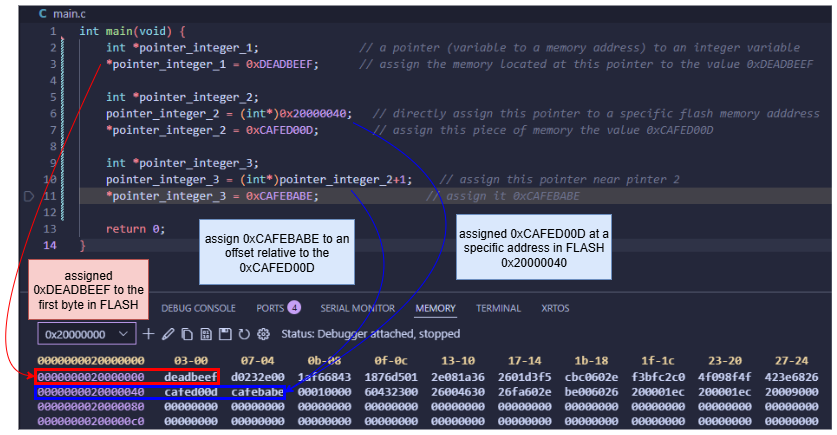

# Memory and Pointers
Visualising how pointer variables work. How they are used to hold memory addresses and how we can use them to assign specific values at the memory address they are holding/pointing to.

*Correction: The variables are stored in SRAM (`0x2000 0000`) and NOT FLASH