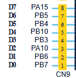
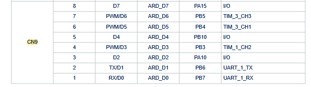
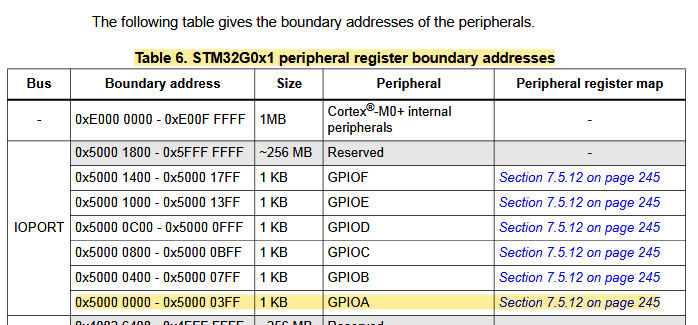
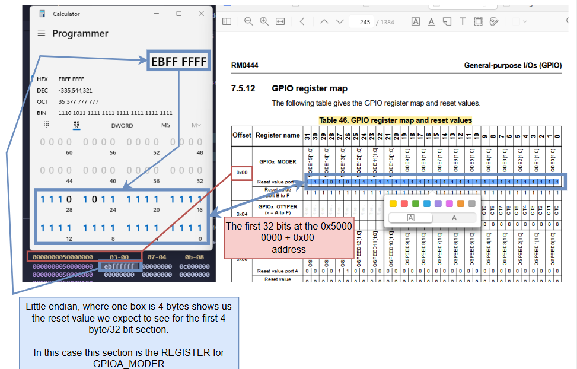

# Control Outside World
Here we will talk to an LED on a breadboard using a GPIO pin.

On the physical board we will choose the `D2` pin as shown in this diagram from the um2953.

Again from um2953 we find which GPIO ports and pins the D2 pin is controlled by, in this case it is `PA10`.

## GPIO A
From the reference manual RM0444, we can see that the memory region responsible for the GPIO ports in A are in between the addresses `0x5000 0000 - 0x5000 03FF`

## Viewing GPIO A's Memory

## Turning on GPIO port
By default the GPIO ports are turned off and has to be initialised, usually this is done by the `startup.c` file provided by the vendor, since we are doing things from scratch we will have to do this ourselves. For now I will do it in `main.c` but later on I might modify my `startup.c` file to do this.

## Making GPIO port output signal
We will want to output a DIGITAL HIGH signal and a DIGITAL LOW signal on a timed basis so that the LED will blink.
